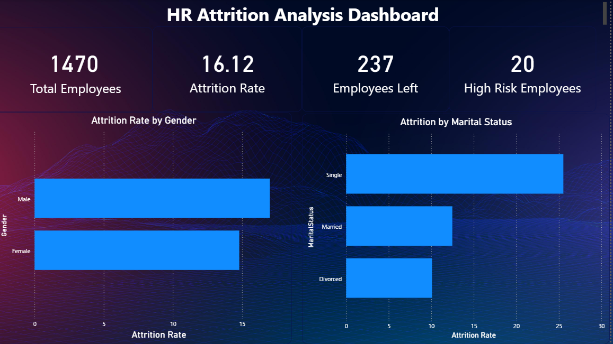
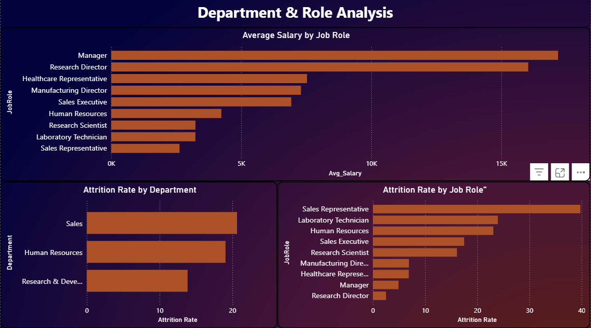
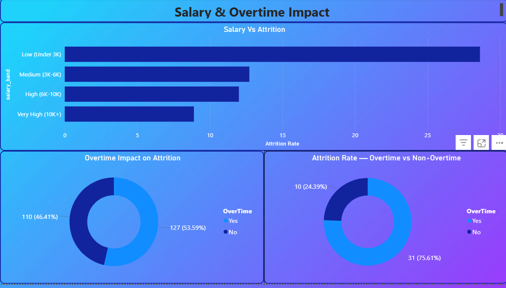
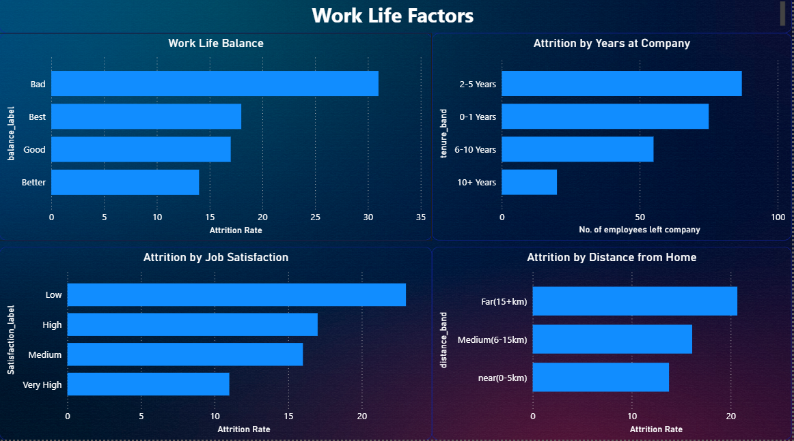
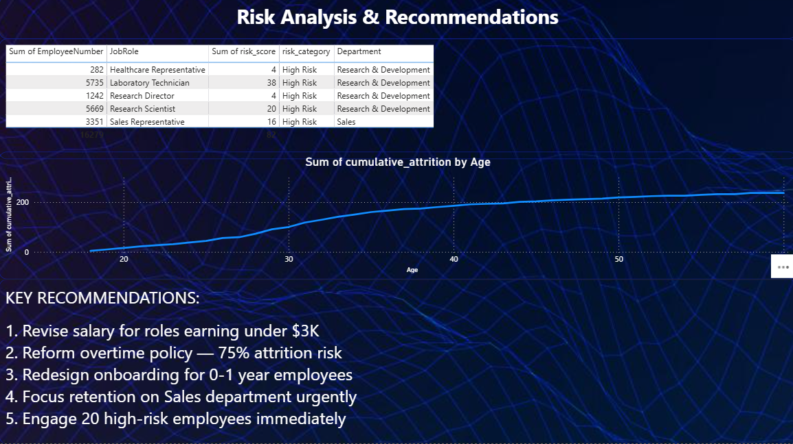

# HR Attrition Analysis — SQL & Power BI Project

## Project Overview
End-to-end HR analytics project analyzing employee 
attrition patterns at a company of 1,470 employees 
using MySQL and Power BI to identify key drivers of 
employee turnover and provide actionable recommendations.

## Problem Statement
The company has a 16.12% attrition rate — above the 
industry benchmark of 10-12%. This analysis identifies 
WHY employees are leaving and WHO is most at risk.

## Tools Used
- MySQL — data storage and complex SQL queries
- Power BI — interactive dashboard and visualization
- Excel — data export and CSV management

## Dataset
- Source: IBM HR Analytics Dataset (Kaggle)
- Records: 1,470 employees
- Features: 35 columns including demographics, 
  salary, satisfaction scores, and attrition status

## Key Findings
- Overall attrition rate: **16.12%** (237 employees left)
- **Sales department** has highest attrition rate
- **Sales Representatives** and **Lab Technicians** 
  are highest risk job roles
- Employees working **overtime** have 75.61% attrition 
  rate vs 24.39% for non-overtime employees
- **Low salary under $3K** is strongest attrition driver
- **0-1 year employees** have highest early attrition
- **Single male employees aged 25-34** are highest 
  flight risk profile
- Only **20 high-risk employees** identified for 
  immediate intervention
- 50% of all attrition happens **before age 35**

## Business Recommendations
1. Revise salary bands for roles earning under $3K
2. Reform overtime policy — 75% attrition risk
3. Redesign onboarding program for 0-1 year employees
4. Focus urgent retention efforts on Sales department
5. Proactively engage 20 identified high-risk employees

## SQL Skills Demonstrated
- Complex multi-condition aggregations
- CASE WHEN statements for segmentation
- CTEs (Common Table Expressions)
- Window Functions (SUM OVER, RANK OVER, LAG)
- Attrition risk scoring using multiple conditions

## Dashboard Pages
1. Executive Summary — KPIs and overview
2. Department & Role Analysis — where attrition happens
3. Salary & Overtime Impact — financial drivers
4. Work Life Factors — satisfaction and tenure analysis
5. Risk Analysis & Recommendations — actionable insights

## Dashboard Screenshots

### Executive Summary

### Department Analysis

### Salary & Overtime

### Work Life Factors

### Risk Analysis

## Project Structure
hr-attrition-analysis/
│
├── README.md
├── queries/
│   ├── 01_attrition_overview.sql
│   ├── 02_department_analysis.sql
│   ├── 03_salary_analysis.sql
│   ├── 04_worklife_analysis.sql
│   └── 05_advanced_analytics.sql
├── exports/
│   └── (CSV files)
└── dashboard/
    └── (Power BI screenshots)

## Author
**Prince Kashyap**
- LinkedIn: linkedin.com/in/prince-kashyap
- GitHub: github.com/Prince-kash
- Email: princekashyap258@gmail.com

